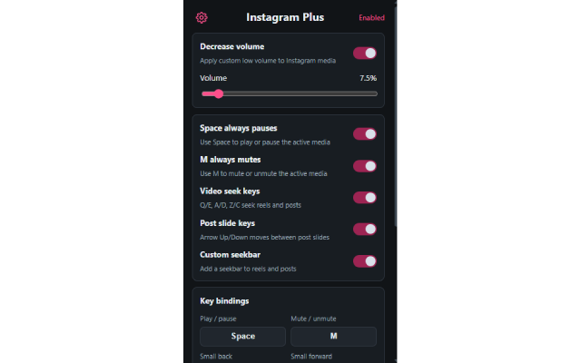

# Instagram Plus

Extension with extra controls for Instagram videos, reels, stories, and posts.

## Features

- Decrease Instagram media volume with a configurable value
- Use Space to play or pause the active video or story
- Use M to mute or unmute the active media
- Seek reels and post videos with configurable keyboard shortcuts and seek durations
- Move between post slides with Arrow Up and Arrow Down
- Add a custom seekbar to reels and post videos
- Import, export, and reset local settings

## Shortcuts

- Default `Q` / `E`: seek backward or forward by 0.1 seconds
- Default `A` / `D`: seek backward or forward by 1 second
- Default `Z` / `C`: seek backward or forward by 3 seconds
- Default `Space`: play or pause active media
- Default `M`: mute or unmute active media
- `Arrow Up` / `Arrow Down`: previous or next post slide

All main media shortcuts and seek durations can be changed in the popup.

## Supported Pages

- `https://instagram.com/*`
- `https://www.instagram.com/*`

## Privacy

- Settings are stored locally in the browser
- The extension does not collect or send Instagram activity to external servers

## Installation

- 🟢 [Chrome Web Store](https://chromewebstore.google.com/detail/gjfkkbfhaebfnjdbomoolocljdknknjc)
- 🦊 [Firefox Add-ons](https://addons.mozilla.org/firefox/addon/instagram-plus/)

## Screenshots

**1. Instagram media controls and shortcut settings**

## Contributing

Feel free to open issues or submit pull requests to improve the extension.
